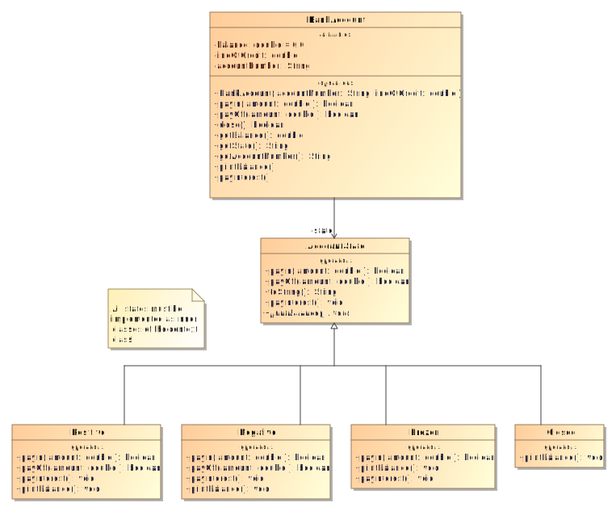

# Bank Account (Exam SS 2017)

The following task uses the State pattern to implement a simple bank account. An account
(class `BankAccount`) can be _opened_ (using the constructor `BankAccount()`) and has an
initial `balance` of 0. An account has the state `Positive`, if its balance is greater
than or equal to 0. If the balance is lower than 0, the account is `Negative`. Money is
added to the account by using the method `payIn()` and withdrawn by calling `payOff()`.

An account can be overdrawn by the amount of the overdraft credit that is specified when
the account is opened (field `lineOfCredit`). If the account’s balance reaches its lowest
limit, no money can be withdrawn anymore until the next call of `payIn()`. The account now
has the state `Frozen` and calls to `payOff()` should return `false`.

Calls of the method `payOff()`, that would exceed the `lineOfCredit`, are unsuccessful and
should return `false`.

An account can only be closed (`BankAccount.close()`), if its balance is 0. After that the
account enters the state `Closed` where no money can be payed in or off anymore. Any
attempt to do so should return `false`.

If the method `payInterest()` is called, the interest is payed. That means in the state
`Positive` 1% of the balance is added. If the state is `Negative` the balance is decreased
by another 3% and in the state `Frozen` 5% are subtracted. Interest always needs to be
paid, so there is no exception if the `balance` exceeds the `lineOfCredit`.

Information about the current balance and state can be aquired by calling
`printBalance()`. Take a look at the following example output:

```java
BankAccount account = new BankAccount("0815", 20);

account.payIn(10)
account.printBalance()  // Balance is POSITIVE: +10.0.

account.payOff(20)
account.printBalance()  // Balance is NEGATIVE: -10.0.

account.payOff(10)
account.printBalance()  // Balance is NEGATIVE: -20.0. You need to pay in money.

account.payIn(20)
account.printBalance()  // Balance is POSITIVE: +0.0.

account.close()
account.printBalance()  // This account is CLOSED. The balance is 0.
```

## Class diagram



## Task

Implement the bank account according to the description and the class diagram above. Use
[inner classes](https://docs.oracle.com/javase/tutorial/java/javaOO/nested.html) of
`BankAccount` to implement the State pattern. The common superclass of `Positive`,
`Negative`, `Frozen` and `Closed` should be called `AccountState`.

## Hints

-   The most important erroneous parameter values must be handled properly. Therefore, the
    parameter value `null` should result in a `NullPointerException` while others like
    empty `String`s, zero or negative numbers that do not make sense should cause an
    `IllegalArgumentException`.
-   The method `AccountState.toString()` should return the simple name of the class, for
    example “Positive” if the state is `Positive`. `BankAccount.getState()` is also
    returning the output of this method.
-   If `lineOfCredit` is set to 0, the account can never enter the state `Frozen`, because
    for a balance equal to 0 the state must be set to `Positive`.
