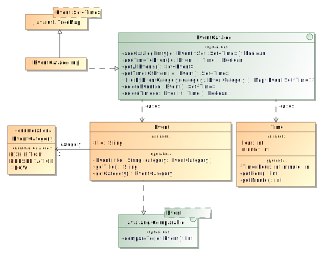

# Event App (Exam SS 2013)

In many places, event nights with varying themes take place, e.g., the _Lange Nacht der
Wissenschaften_ in Dresden. To make information about event nights accessible, an
application for mobile devices has to be created. In this task, we want to focus on an
event catalog for such a possible event night application.

An `Event` is defined by its `title` and an `EventCategory` which can be either an
`EXHIBITION`, a `PRESENTATION` or a `SHOW`. Additionally, `Event` implements
`Comparable<Event>`. `Event`s can be compared to other `Event`s by their title, and if the
title is equal, by their category.

The other central data class in this system is `Time`. Its objects are defined by two
_valid_ integers for the hour and minute of a certain point of time. Note that `Time` is
using the 24-hour clock.

The interface `EventCatalog` defines methods needed to store and manage events in a manner
where an `Event` is associated with (possibly several) `Time` objects that represent the
times at which the `Event` takes place. Apply one of the adapter patterns to use the class
`java.util.TreeMap<K,V>` for the actual storage of the data.

-   `addCatalogEntry()`: In case the catalog does not contain the `Event`, adds the
    `Event` to the catalog, associates it with the given `Time` objects and returns
    `true`. Otherwise, just returns `false`. It is important to note that all of the
    `Time` objects within the `Set` must be checked for validity. This way, no invalid
    `Time` object will be stored in the catalog.
-   `addTimeToEvent()`: In case the catalog contains the `Event` and it is not associated
    to the `Time`, adds the association and returns `true` (otherwise `false`).
-   `getTimesOfEvent()`: In case the catalog contains the `Event`, returns the associated
    `Time` objects in a `Set`. Otherwise returns `null`.
-   `filterByEventCategory()`: Returns a non-`null` `Map<Event, Set<Time>>` containing
    only those events of the given category. Each of the `Event` objects has to be
    associated to a `Set` with the `Time` objects that the `Event` is associated to within
    the `EventCatalog`.
-   `deleteEvent()`: In case the catalog contains the `Event`, removes it and returns a
    `Set` with all the `Time` objects the `Event` was associated to. Otherwise returns
    `null`.
-   `deleteTime()`: In case the catalog contains the `Event` and the latter is associated
    to the `Time`, removes the association and returns `true`. Otherwise returns `false`.

<!-- -->

## Class Diagram

## Task

Create the given interface and implement all of the classes above!

## Hints

-   The most important erroneous parameter values must be handled properly. Therefore, the
    parameter value `null` should result in a `NullPointerException` while others like
    empty `String`s or integers that do not make sense should cause an
    `IllegalArgumentException`.
-   When you implement `Event.compareTo()`, it’s good to know that strings and enums
    already implement the `Comparable<T>` interface. Think about [what the `compareTo()`
    return values
    mean](<https://docs.oracle.com/en/java/javase/11/docs/api/java.base/java/lang/Comparable.html#compareTo(T)>)
    and how you can reuse them.
-   Take care to declare the `enum` constants/literals in the same order as shown in the
    class diagram.
